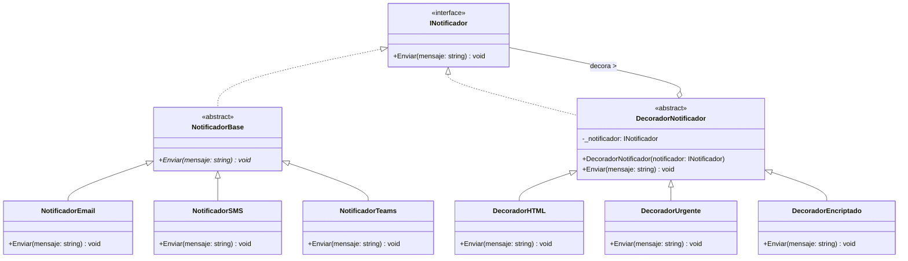
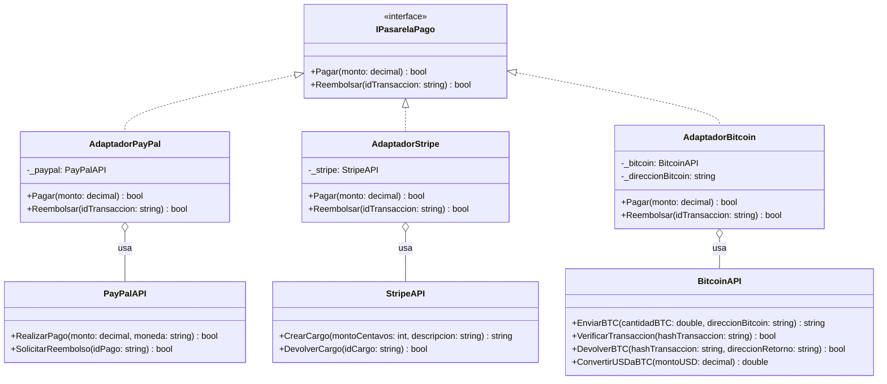

# Trabajo de Diseño de patrones y diseño de software - Patrones estructurales

### Integrantes: 
 #### - Wilson Andrés Vargas Rojas
 #### - Yeison Fabian Suarez Alba 
<br>
Este trabajo está construido con C# y constituido de la siguiente manera:
<br>
<br>

```plaintext
│── Problema (Patrón adapter)
│   ├── Código fuente
│── Problema 2 (Patrón decorator)
│   ├── Código fuente
│── Notebook (sin diagramas UML)
│── Readme con explicación y diagrams UML

```
<br>

### Tabla de contenido

- [Patrón Decorator](#definicion-del-problema-1-que-se-desean-abordar)
  * [Diagrama UML](#diagrama-uml-1)

- [Patrón Adapter](#definicion-del-problema-2-que-se-desean-abordar)
  * [Diagrama UML](#diagrama-uml-2)


## Definición del problema 1 que se desean abordar:
Se tiene un sistema de notificaciones en el que estas se envía por correo, sin embargo debe funcionar para multiples sistemas y cada vez se vuelve más grande, ya que queriendose respetar el principio Open/Close de SOLID extender la funcionalidad por medio de la herencia se vuelve complejo. 

Queriendo evitar esto, se realiza un Patrón Decorator con el fín de remplazar la herencia por la composición o agregación, lo que se irá explicando.

### Los tipos de notificación.

Lo primero es construir una interfaz de notificaciones:


```C#
public interface INotificador
    {
        void Enviar(string mensaje);
    }
```

Despúes se debe definir las notificaciones que conocemos por el momento, sin embargo como queremos que estás sean diversas, lo principal es crear una clase abstracta para que sea el contrato entre los tipos de notificaciones, una base para notificar:


```C#

public abstract class NotificadorBase : INotificador
    {
        public abstract void Enviar(string mensaje);
    }
```

Ahora sí, los tipos de notificación:


```C#
public class NotificadorEmail : NotificadorBase
    {
        public override void Enviar(string mensaje)
        {
            Console.WriteLine($"Enviando email: {mensaje}");
        }
    }

public class NotificadorSMS : NotificadorBase
    {
        public override void Enviar(string mensaje)
        {
            Console.WriteLine($"Enviando SMS: {mensaje}");
        }
    }
```

Hasta aquí no hay nada raro, el contrato ```NotificadorBase``` indica que se debe notificar y las clases concretas de ```NotificadorEmai```  y ```NotificadorSMS``` dictan como hacerlo, pero ahora surgen varios problemas.

El primero de ellos es, que debo hacer si tengo que notificar un correo, pero en HTML o encriptado o Notificar a SMS usando un número privado?

### Los decoradores.
Lo lógico sería heredar y seguir heredando, pero la herencia es estatica, no se puede cambiar en tiempo de ejecución, mientras que con la composición un objeto tiene una referencia a otro y le delega parte del trabajo, en este caso el comportamiento adicional (HTML, encriptado, Privado, etc). Estos comportamientos se definen como decoradores.

#### Decorador base:
El notificador termina siendo usado por el decorador base


```C#
public abstract class DecoradorNotificador : INotificador
    {
        protected readonly INotificador _notificador;

        public DecoradorNotificador(INotificador notificador)
        {
            _notificador = notificador;
        }

        public virtual void Enviar(string mensaje)
        {
            _notificador.Enviar(mensaje);
        }
    }
```

#### Decoradores concretos:


```C#
public class DecoradorHTML : DecoradorNotificador
    {
        public DecoradorHTML(INotificador notificador) : base(notificador) { }

        public override void Enviar(string mensaje)
        {
            Console.WriteLine("[HTML] Formateando mensaje a HTML");
            base.Enviar($"<html><body><p>{mensaje}</p></body></html>");
        }
    }

public class DecoradorUrgente : DecoradorNotificador
    {
        public DecoradorUrgente(INotificador notificador) : base(notificador) { }

        public override void Enviar(string mensaje)
        {
            Console.WriteLine("[URGENTE] Marcando mensaje como urgente");
            base.Enviar($"¡URGENTE! {mensaje}");
        }
    }
```

Ahora puedo especificar no sólo el tipo de notificación, si no darle comportamientos adicionales:


```C#
// Crear notificador base (Email)
INotificador notificador = new NotificadorEmail();
Console.WriteLine("\nNotificación básica por email:");
notificador.Enviar("Este es un mensaje normal");

// Decorar con formato HTML
notificador = new DecoradorHTML(notificador);
Console.WriteLine("\nNotificación con formato HTML:");
notificador.Enviar("Este mensaje tiene formato HTML");

// Decorar con marca de urgente
notificador = new DecoradorUrgente(notificador);
Console.WriteLine("\nNotificación HTML + Urgente:");
notificador.Enviar("Este mensaje es importante");

// Crear una nueva cadena con SMS
Console.WriteLine("\nNueva cadena de notificaciones con SMS:");
INotificador notificadorSMS = new NotificadorSMS();
notificadorSMS = new DecoradorUrgente(notificadorSMS);
notificadorSMS.Enviar("Alerta por SMS");
```

    
    Notificación básica por email:
    Enviando email: Este es un mensaje normal
    
    Notificación con formato HTML:
    [HTML] Formateando mensaje a HTML
    Enviando email: <html><body><p>Este mensaje tiene formato HTML</p></body></html>
    
    Notificación HTML + Urgente:
    [URGENTE] Marcando mensaje como urgente
    [HTML] Formateando mensaje a HTML
    Enviando email: <html><body><p>¡URGENTE! Este mensaje es importante</p></body></html>
    
    Nueva cadena de notificaciones con SMS:
    [URGENTE] Marcando mensaje como urgente
    Enviando SMS: ¡URGENTE! Alerta por SMS


### Añadiendo nuevas motificaciones y comportamientos:
Si queremos añadir nuevos tipos de notificaciones y comportamientos, solo basta con seguir nuestro principio SOLID Open/Close, extender las funcionalidades.
Añadamos Teams como notificación y un comportamiento de encriptación:


```C#
public class NotificadorTeams : NotificadorBase
    {
        public override void Enviar(string mensaje)
        {
            Console.WriteLine($"Enviando mensaje por Teams: {mensaje}");
        }
    }

public class DecoradorEncriptado : DecoradorNotificador
    {
        public DecoradorEncriptado(INotificador notificador) : base(notificador) { }

        public override void Enviar(string mensaje)
        {
            Console.WriteLine("[ENCRIPTADO] Simulando encriptación del mensaje...");
            base.Enviar(mensaje);
        }
    }
```

y luego podremos combinar todos los decoradores si queremos:


```C#
// Ejemplo combinando todos los decoradores
Console.WriteLine("\nEjemplo completo (Teams + HTML + Urgente + Encriptado):");
INotificador notificadorCompleto = new NotificadorTeams();
notificadorCompleto = new DecoradorHTML(notificadorCompleto);
notificadorCompleto = new DecoradorUrgente(notificadorCompleto);
notificadorCompleto = new DecoradorEncriptado(notificadorCompleto);
notificadorCompleto.Enviar("Mensaje importante y confidencial");
```

    
    Ejemplo completo (Teams + HTML + Urgente + Encriptado):
    [ENCRIPTADO] Simulando encriptación del mensaje...
    [URGENTE] Marcando mensaje como urgente
    [HTML] Formateando mensaje a HTML
    Enviando mensaje por Teams: <html><body><p>¡URGENTE! Mensaje importante y confidencial</p></body></html>

### Diagrama UML 1



## Definición del problema 2 que se desean abordar:
Se tiene una pasarela de pagos en la que queremos hacer transferencias y reembolsos con diferentes medios de pago y transferencia, estas usan APIs en las qu se hacen transacciones, sin embargo cada uno de los métodos de uso de las API no se adapta a los nuevos estandares de las pasarelas de pago, se necesita adaptar las APIs.

### La interfaz de la pasarela de pagos
Manteniendo los principios SOLID, se usa una interfaz como contrato entre los métodos de pago.


```C#
public interface IPasarelaPago
    {
        bool Pagar(decimal monto);
        bool Reembolsar(string idTransaccion);
    }
```

### Las APIs
En este caso se tiene a PayPal y Stripe como métodos de pago


```C#
public class PayPalAPI
    {
        public bool RealizarPago(decimal monto, string moneda)
        {
            Console.WriteLine($"PayPal: Procesando pago de {monto} {moneda}");
            return true;
        }

        public bool SolicitarReembolso(string idPago)
        {
            Console.WriteLine($"PayPal: Reembolsando pago ID: {idPago}");
            return true;
        }
    }

public class StripeAPI
    {
        public string CrearCargo(int montoCentavos, string descripcion)
        {
            Console.WriteLine($"Stripe: Creando cargo de {montoCentavos/100.0m:C} - {descripcion}");
            return "ch_" + Guid.NewGuid().ToString();
        }

        public bool DevolverCargo(string idCargo)
        {
            Console.WriteLine($"Stripe: Devolviendo cargo ID: {idCargo}");
            return true;
        }
    }
```

Notese como no se puede hacer un uso de la interfaz de manera directa, empezando primero que los métodos de cada API llevan nombres distintos y que cada uno de estos métodos usan tipos de datos diferentes (Uno recibe valores enteros de pago por cetavos), pero el estandar es usar el tipo decimal, hacer estas conversiones en el código cliente, rompe con los principios SOLID, por lo que se debe aplicar el patrón Adapter

### Los adapatadores
Con los adpatadores estoy que dos APIs que no están estandarizadas lo sean


```C#
public class AdaptadorPayPal : IPasarelaPago
    {
        private readonly PayPalAPI _paypal;

        public AdaptadorPayPal(PayPalAPI paypal)
        {
            _paypal = paypal;
        }

        public bool Pagar(decimal monto)
        {
            return _paypal.RealizarPago(monto, "USD");
        }

        public bool Reembolsar(string idTransaccion)
        {
            return _paypal.SolicitarReembolso(idTransaccion);
        }
    }

public class AdaptadorStripe : IPasarelaPago
    {
        private readonly StripeAPI _stripe;

        public AdaptadorStripe(StripeAPI stripe)
        {
            _stripe = stripe;
        }

        public bool Pagar(decimal monto)
        {
            int montoCentavos = (int)(monto * 100);
            string idCargo = _stripe.CrearCargo(montoCentavos, "Compra");
            return !string.IsNullOrEmpty(idCargo);
        }

        public bool Reembolsar(string idTransaccion)
        {
            return _stripe.DevolverCargo(idTransaccion);
        }
    }
```

Ahora llamando el código cliente se tendría:


```C#
// Crear instancias de las APIs externas
var paypalAPI = new PayPalAPI();
var stripeAPI = new StripeAPI();

// Crear adaptadores
IPasarelaPago pasarelaPayPal = new AdaptadorPayPal(paypalAPI);
IPasarelaPago pasarelaStripe = new AdaptadorStripe(stripeAPI);

// Probar PayPal
Console.WriteLine("\n--- Probando PayPal ---");
bool resultadoPayPal = pasarelaPayPal.Pagar(150.75m);
Console.WriteLine($"Resultado del pago: {resultadoPayPal}");

if (resultadoPayPal)
{
    bool reembolsoPayPal = pasarelaPayPal.Reembolsar("PAY-12345");
    Console.WriteLine($"Resultado del reembolso: {reembolsoPayPal}");
}

// Probar Stripe
Console.WriteLine("\n--- Probando Stripe ---");
bool resultadoStripe = pasarelaStripe.Pagar(200.50m);
Console.WriteLine($"Resultado del pago: {resultadoStripe}");

if (resultadoStripe)
{
    bool reembolsoStripe = pasarelaStripe.Reembolsar("ch_abc123");
    Console.WriteLine($"Resultado del reembolso: {reembolsoStripe}");
}

```

    
    --- Probando PayPal ---
    PayPal: Procesando pago de 150,75 USD
    Resultado del pago: True
    PayPal: Reembolsando pago ID: PAY-12345
    Resultado del reembolso: True
    
    --- Probando Stripe ---
    Stripe: Creando cargo de $ 201 - Compra
    Resultado del pago: True
    Stripe: Devolviendo cargo ID: ch_abc123
    Resultado del reembolso: True


### Añadiendo otra API de pago
Añadamos por ejemplo Bitcoin, en la que usamos una API y creamos su adaptador:


```C#
public class BitcoinAPI
    {
        public string EnviarBTC(double cantidadBTC, string direccionBitcoin)
        {
            Console.WriteLine($"BitcoinAPI: Enviando {cantidadBTC} BTC a la dirección {direccionBitcoin}");
            // Simulación de envío de Bitcoin
            if (cantidadBTC > 0 && !string.IsNullOrEmpty(direccionBitcoin))
            {
                Console.WriteLine("BitcoinAPI: Transacción completada exitosamente");
                return $"tx_{Guid.NewGuid().ToString("N")}"; // Simula un hash de transacción
            }
            Console.WriteLine("BitcoinAPI: Error - Transacción fallida");
            return string.Empty;
        }

        public bool VerificarTransaccion(string hashTransaccion)
        {
            Console.WriteLine($"BitcoinAPI: Verificando transacción {hashTransaccion}");
            // Simulación de verificación de transacción
            bool resultado = !string.IsNullOrEmpty(hashTransaccion);
            Console.WriteLine($"BitcoinAPI: Transacción {(resultado ? "válida" : "inválida")}");
            return resultado;
        }

        public bool DevolverBTC(string hashTransaccion, string direccionRetorno)
        {
            Console.WriteLine($"BitcoinAPI: Iniciando reembolso para la transacción {hashTransaccion}");
            Console.WriteLine($"BitcoinAPI: Dirección de retorno: {direccionRetorno}");
            // Simulación de devolución de Bitcoin
            if (!string.IsNullOrEmpty(hashTransaccion) && !string.IsNullOrEmpty(direccionRetorno))
            {
                Console.WriteLine("BitcoinAPI: Reembolso completado exitosamente");
                return true;
            }
            Console.WriteLine("BitcoinAPI: Error - Reembolso fallido");
            return false;
        }

        public double ConvertirUSDaBTC(decimal montoUSD)
        {
            Console.WriteLine($"BitcoinAPI: Convirtiendo ${montoUSD} USD a BTC");
            // Simulación de tasa de conversión (1 BTC = 50,000 USD)
            const decimal TASA_BTC_USD = 50000m;
            double cantidadBTC = (double)(montoUSD / TASA_BTC_USD);
            Console.WriteLine($"BitcoinAPI: ${montoUSD} USD = {cantidadBTC} BTC (Tasa: 1 BTC = ${TASA_BTC_USD} USD)");
            return cantidadBTC;
        }
    }

public class AdaptadorBitcoin : IPasarelaPago
    {
        private readonly BitcoinAPI _bitcoin;
        private readonly string _direccionBitcoin;

        public AdaptadorBitcoin(BitcoinAPI bitcoin, string direccionBitcoin)
        {
            _bitcoin = bitcoin;
            _direccionBitcoin = direccionBitcoin;
        }

        public bool Pagar(decimal monto)
        {
            double cantidadBTC = _bitcoin.ConvertirUSDaBTC(monto);
            string hashTransaccion = _bitcoin.EnviarBTC(cantidadBTC, _direccionBitcoin);
            return !string.IsNullOrEmpty(hashTransaccion);
        }

        public bool Reembolsar(string idTransaccion)
        {
            return _bitcoin.DevolverBTC(idTransaccion, _direccionBitcoin);
        }
    }
```

Por último la usamos siguiendo el mismo estandar


```C#
var bitcoinAPI = new BitcoinAPI();

IPasarelaPago pasarelaBitcoin = new AdaptadorBitcoin(bitcoinAPI, "1A1zP1eP5QGefi2DMPTfTL5SLmv7DivfNa"); // Dirección Bitcoin de ejemplo

// Probar Bitcoin
Console.WriteLine("\n--- Probando Bitcoin ---");
bool resultadoBitcoin = pasarelaBitcoin.Pagar(0.05m); // Monto pequeño en USD para el ejemplo
Console.WriteLine($"Resultado del pago: {resultadoBitcoin}");

if (resultadoBitcoin)
{
    bool reembolsoBitcoin = pasarelaBitcoin.Reembolsar("tx_abc123def456");
    Console.WriteLine($"Resultado del reembolso: {reembolsoBitcoin}");
}
```

    
    --- Probando Bitcoin ---
    BitcoinAPI: Convirtiendo $0,05 USD a BTC
    BitcoinAPI: $0,05 USD = 1E-06 BTC (Tasa: 1 BTC = $50000 USD)
    BitcoinAPI: Enviando 1E-06 BTC a la dirección 1A1zP1eP5QGefi2DMPTfTL5SLmv7DivfNa
    BitcoinAPI: Transacción completada exitosamente
    Resultado del pago: True
    BitcoinAPI: Iniciando reembolso para la transacción tx_abc123def456
    BitcoinAPI: Dirección de retorno: 1A1zP1eP5QGefi2DMPTfTL5SLmv7DivfNa
    BitcoinAPI: Reembolso completado exitosamente
    Resultado del reembolso: True


### Diagrama UML 2


