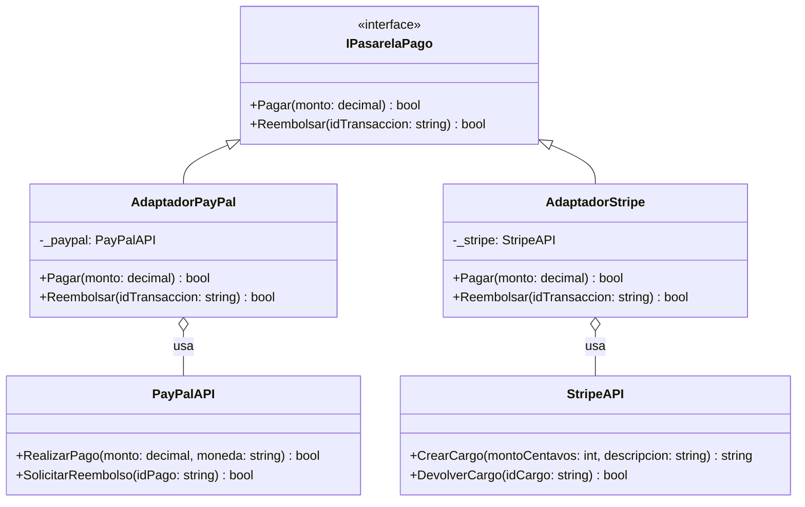

# Diagrama UML

## Patrón adapter

```mermaid
classDiagram
    %% Patrón Adapter - Integración con APIs de Pago
    direction TB
    
    class IPasarelaPago {
        <<interface>>
        +Pagar(monto: decimal) bool
        +Reembolsar(idTransaccion: string) bool
    }
    
    class PayPalAPI {
        +RealizarPago(monto: decimal, moneda: string) bool
        +SolicitarReembolso(idPago: string) bool
    }
    
    class StripeAPI {
        +CrearCargo(montoCentavos: int, descripcion: string) string
        +DevolverCargo(idCargo: string) bool
    }
    
    class AdaptadorPayPal {
        -_paypal: PayPalAPI
        +Pagar(monto: decimal) bool
        +Reembolsar(idTransaccion: string) bool
    }
    
    class AdaptadorStripe {
        -_stripe: StripeAPI
        +Pagar(monto: decimal) bool
        +Reembolsar(idTransaccion: string) bool
    }
    
    %% Relaciones
    IPasarelaPago <|-- AdaptadorPayPal
    IPasarelaPago <|-- AdaptadorStripe
    
    AdaptadorPayPal o-- PayPalAPI : usa
    AdaptadorStripe o-- StripeAPI : usa
```
