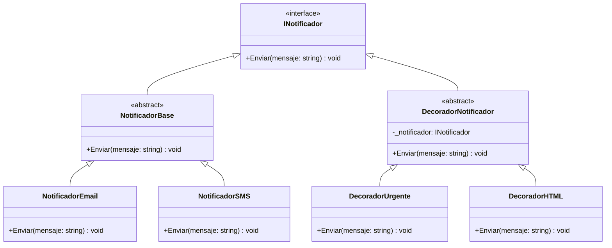

# Diagrama UML

## Patrón Decorator

```mermaid
classDiagram
    %% Patrón Decorator - Sistema de Notificaciones
    direction TB
    
    class INotificador {
        <<interface>>
        +Enviar(mensaje: string) void
    }
    
    class NotificadorBase {
        <<abstract>>
        +Enviar(mensaje: string) void
    }
    
    class NotificadorEmail {
        +Enviar(mensaje: string) void
    }
    
    class NotificadorSMS {
        +Enviar(mensaje: string) void
    }
    
    class DecoradorNotificador {
        <<abstract>>
        -_notificador: INotificador
        +Enviar(mensaje: string) void
    }
    
    class DecoradorUrgente {
        +Enviar(mensaje: string) void
    }
    
    class DecoradorHTML {
        +Enviar(mensaje: string) void
    }
    
    %% Relaciones
    INotificador <|-- NotificadorBase
    NotificadorBase <|-- NotificadorEmail
    NotificadorBase <|-- NotificadorSMS
    
    INotificador <|-- DecoradorNotificador
    DecoradorNotificador <|-- DecoradorUrgente
    DecoradorNotificador <|-- DecoradorHTML
```
